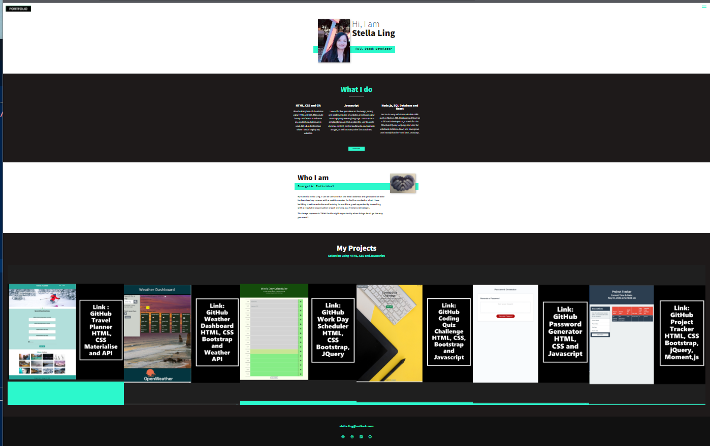
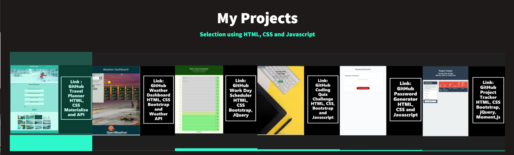

## 08 PROJECT 1 PROFESSIONAL MATERIALS

The requirements are to:-

```
SUBMIT an updated portfolio featuring Project 1 and two exemplary assignments.
SUBMIT an updated GitHub profile with pinned respositories featuring Project 1 and two exemplary assignments
SUBMIT an updated resume
SUBMIT an updated Linkedln profile

```

### UPDATED PORTFOLIO

Overview of the updated portfolio:-



#### <em>1. Contact Information</em> 
The contact information is located on the footer page of the portfolio.


#### <em>2. Have links to GitHub Profile and Linkedln Profile</em>
Click on GitHub icon will lead to  [Github](https://github.com/stellalph) profile and clicking on the Linkedln icon will lead to the  [Linkedln](https://www.linkedin.com/in/stella-ling-46246476/) 


#### <em>3. Have a link to a downloadable PDF of the resume</em>


Click on the [RESUME](https://drive.google.com/file/d/14OJbyFC8qyn0dJe3jUYV2ukX46gtuRGH/view?usp=sharing) button will bring on the downloadable PDF of the resume.  Please be patient as this takes time to load.

#### <em>4. Displaying at least two examples of student work from either deployed projects or homeworks</em>

<strong>Click on the different images will lead to the deployed version</strong>, GitHub repository, the project title and the screenshot of the deployed application.



Starting from the left:-

* Travel Planner (Group Project)

  - The URL of the deployed application for the Travel Planner is https://chardige.github.io/Travel-planner/

* Weather Dashboard
 
  - The URL of the deployed application for the Weather Dashboard is https://stellalph.github.io/WEATHER-DASHBOARD/
  
* Work Day Scheduler

  - The URL of the deployed application for Work Day Scheduler is https://stellalph.github.io/WORK_DAY_SCHEDULER/

* Coding Quiz Challenge

  - The URL of the deployed application for Coding Quiz Challenge is https://stellalph.github.io/JS_CODE_QUIZ/

* Password Generator

  - The URL of the deployed application for Password Generator is https://stellalph.github.io/PASSWORD-GENERATOR/

* Project Tracker

  - The URL of the deployed application for Project Tracker is https://stellalph.github.io/PROJECT-TRACKER/

The URL of the deployed application : https://stellalph.github.io/PM-PORTFOLIO/

The URL of the GitHub repository : https://github.com/stellalph/PM-PORTFOLIO.git

The name of the repository is PM-PORTFOLIO

Technologies used :  HTML, CSS and Javascript

### UPDATED GitHUB Profile

Overview of the updated profile.


The profile is now updated to include:-
* photo
* biography
* link to deployed portfolio
* pinned projects
* following a few developers

I have decided not to use MIT License at this stage and will consider to have this in the near future and due to privacy act, the contact information for any collaborators is not released.

### UPDATED RESUME

The updated resume as mentioned can be retrieved by clicking on the [RESUME](https://drive.google.com/file/d/14OJbyFC8qyn0dJe3jUYV2ukX46gtuRGH/view?usp=sharing) button of the deployed application of the portfolio.

### UPDATED LINKEDLN

 The linkedln profile has also been updated.

 As mentioned, this can be retrieved by click of the [Linkedln](https://www.linkedin.com/in/stella-ling-46246476/) icon.


