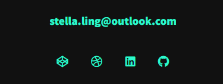

## 08 PROJECT 1 PROFESSIONAL MATERIALS

The requirements are to:-

```
SUBMIT an updated portfolio featuring Project 1 and two exemplary assignments.
SUBMIT an updated GitHub profile with pinned respositories featuring Project 1 and two exemplary assignments
SUBMIT an updated resume
SUBMIT an updated Linkedln profile

```

### UPDATED PORTFOLIO

Overview of the updated portfolio:-


#### <em>1. Contact Information</em> 
The contact information is located on the footer page of the portfolio.


#### <em>1. Have links to GitHub Profile and Linkedln Profile</em>
Click on GitHub icon ![alt text][img/GitHub.png] will lead to Gitub profile and clicking on the Linkedln icon![alt text][img/Linkedln.png] will lead to the Linkedln profile
